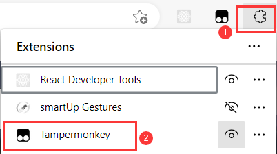
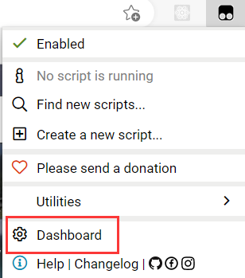

# How to disable CCSFSPH

During your using process, if you meet some problems or just don't want to use it anymore. You could disable the script, the website will display its origin page.

If you have any problems during you using, you could contact us at: [ccsfsph@gmail.com](mailto:ccsfsph@gmail.com)

If you would like to share the same problem with others, and let other people help you, you can create an new issues at: [https://github.com/ccsfsph/ccsf-schedule-planner-helper/issues][https://github.com/ccsfsph/ccsf-schedule-planner-helper/issues]

Find a icon like puzzle on your browser, and then click `Tampermonkey`

Then, click `Dashboard`

Find the `CCSF Schedule Planner Helper`, and click the button to make it gray. Just like the picture show

