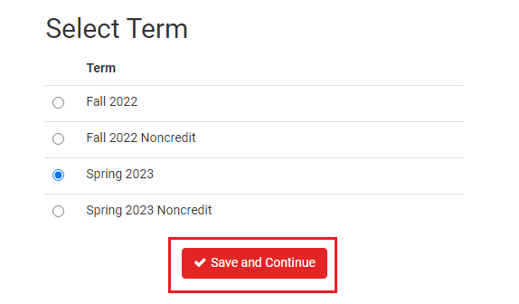

# How to use CCSFSPH

## 1. Login Schedule Planner

[https://ccsf.collegescheduler.com/entry](https://ccsf.collegescheduler.com/entry)

Choose one term

You could see that there is a column called `Instructor Email`，and the Instructor column also have the score.

Click the name of Instructor, You could jump to RateMyProfessor link.

Click the email, you could edit the email directly, but you need to download mail client first.

When you are making a generate schedule, you could see the capacity for this class.

