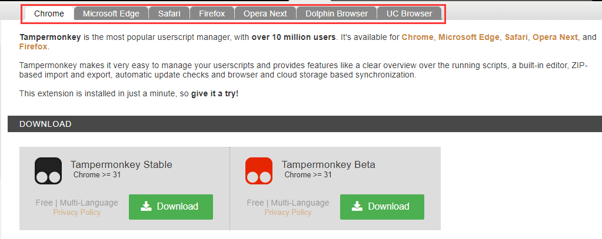
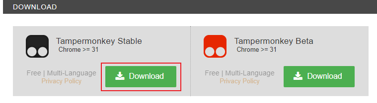

# Install Tampermonkey

> Notice：
>
> Since we develop the CCSFSPH script based on the `Chrome` browser, although other browsers like: Microsoft Edge、Safari、Firefox are supported as well, but there may have some incompatible problems. To prevent this case happen, we strongly recommend all the user use `chrome` browser.
>
> `Chrome` browser download link: [https://www.google.com/chrome/](https://www.google.com/chrome/)
>
> Besides, `CCSFSPH` doesn't support the mobile device, so there are no effect if you install on your mobile device!
>
> If you haven't install `Chrome` browser before, you could also use your using browser to install first. If there are some problems during your installation, you could come back to install `Chrome` browser again.

Use your browser (Chrome or Microsoft Edge or Safari or Firefox and so on）to download Tampermonkey: [https://www.tampermonkey.net/](https://www.tampermonkey.net/)

Choose your browser. In most cases, the page will help you choose your browser automatically. If not, please choose by yourself.

Choose `Stable` version, and click `Download`

Finish the install after you jump to another page.

After you install the Tampermonkey successfully, you still need to [install CCSFSPH Script](./install-ccsfsph-script)

