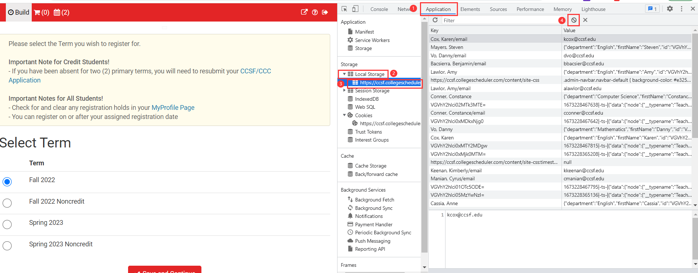
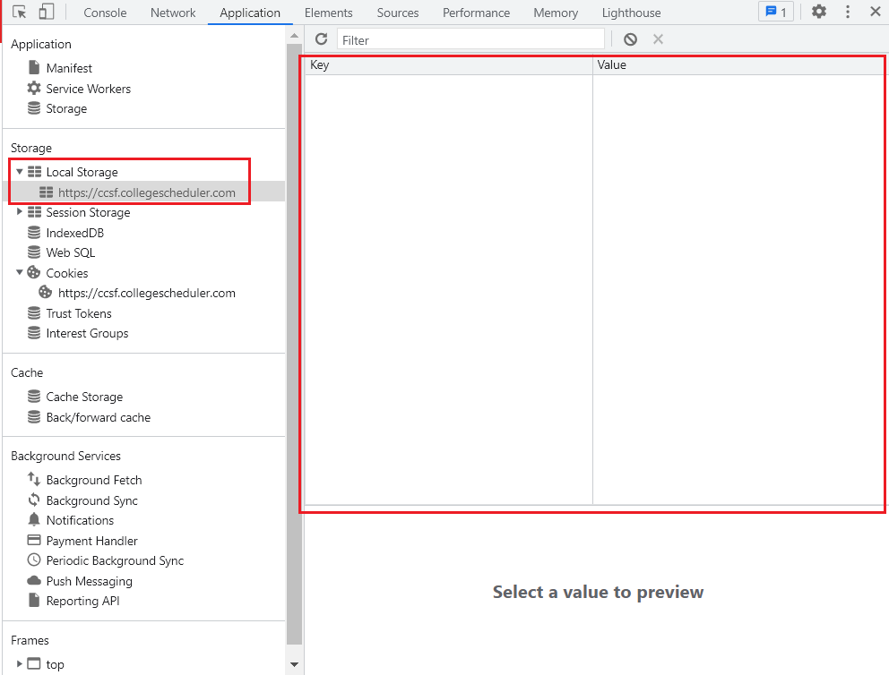

# How to remove CCSFSPH cache

To save up the next time page render time, CCSFSPH will generate the local cache after querying data from third-party.

If you found data on your page doesn't render on time, or it's incorrect, you could try to remove the local cache.

Access Schedule Planner and login: [https://ccsf.collegescheduler.com/](https://ccsf.collegescheduler.com/)

After login successfully，press down <kbd>F12</kbd> 

On the pop up page, find the `Application` from the tab --> click `Local Storage` --> choose `https://ccsf.collegescheduler.com` --> click button to remove all the cache.

If you can see the following page, it means that you clear cache successfully.

Then press down <kbd>F5</kbd> to refresh the page.

Since clear the cache, the first time load the page take more time.

