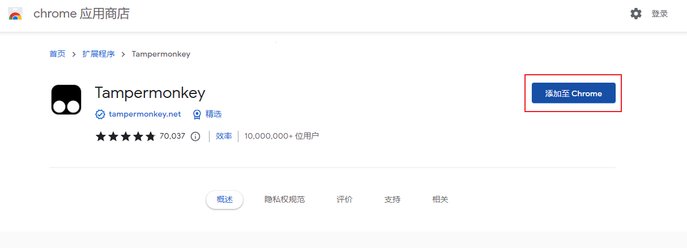
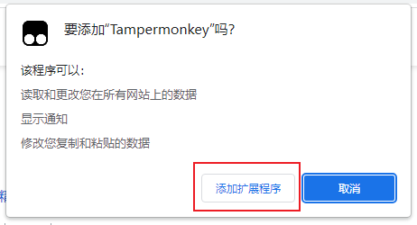
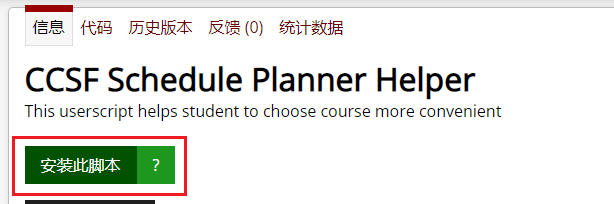
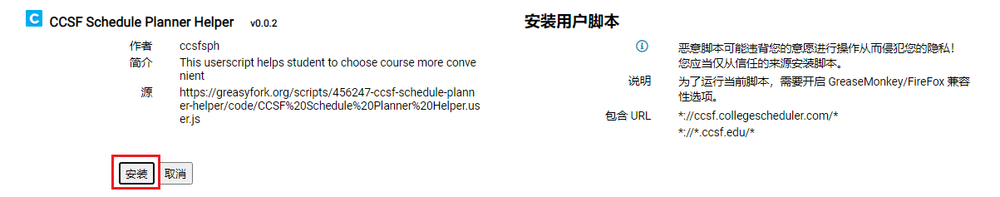

# 通过 Chrome 浏览器安装 CCSFSPH

## 1. 安装 Tampermonkey

从 chrome 应用商店安装 Tampermonkey：[https://chrome.google.com/webstore/detail/tampermonkey/dhdgffkkebhmkfjojejmpbldmpobfkfo?hl=zh-CN](https://chrome.google.com/webstore/detail/tampermonkey/dhdgffkkebhmkfjojejmpbldmpobfkfo?hl=zh-CN)

然后点击右边的蓝色按钮【添加至 Chrome】

点击【添加扩展程序】

## 2. 安装 CCSFSPH 脚本

打开网址：[https://greasyfork.org/zh-CN/scripts/456247-ccsf-schedule-planner-helper](https://greasyfork.org/zh-CN/scripts/456247-ccsf-schedule-planner-helper)

点击【安装此脚本】

点击【安装】

安装完成后，快来看下怎么使用吧~ [点击查看如何使用 CCSFSPH](../usage/usage-ccsfsph)

