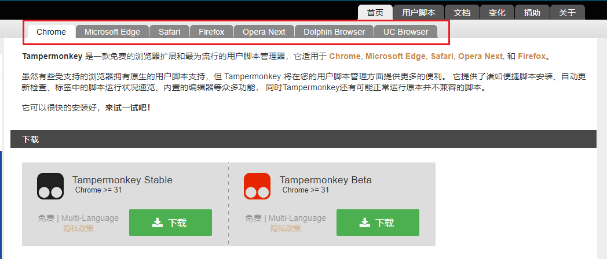
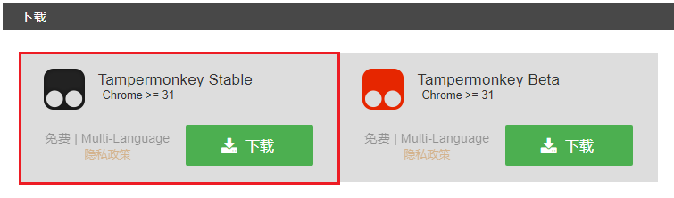

# 安装 Tampermonkey

> 注意：
>
> 由于开发过程中是基于 `Chrome` 浏览器的，其他浏览器如：Microsoft Edge、Safari、Firefox 等理论上也是可以的，但是不排除可能存在兼容性问题，为了避免不一致强烈推荐统一使用 `Chrome` 浏览器。
>
> `Chrome` 浏览器下载地址：[https://www.google.com/chrome/](https://www.google.com/chrome/)
>
> 另外，`CCSFSPH` 不支持移动端，在移动端上使用没有任何效果。
>
> 如果你还没有安装 `Chrome` 浏览器，你可以先用你正在使用的浏览器安装，如果出现了问题，可以再来安装 `Chrome` 浏览器。

使用你的浏览器（Chrome 或者 Microsoft Edge 或者 Safari 或者 Firefox 等）下载 Tampermonkey：[https://www.tampermonkey.net/](https://www.tampermonkey.net/)

选择你正在使用的浏览器，一般情况下，会自动帮你切换到你正在使用到的浏览器，如果没有，请手动选择。

选择 `Stable` 稳定版本，然后点击【下载】

在跳转后的页面完成安装。

安装好 Tampermonkey 之后，还需要[安装 CCSFSPH 脚本](./install-ccsfsph-script)
