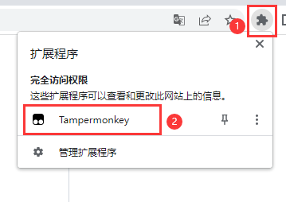
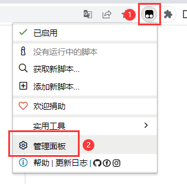
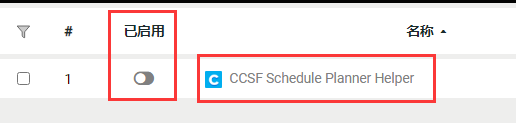

# 如何禁用 CCSFSPH

在使用过程，如果遇到了 BUG 或者不想用了，可以关闭脚本，那就会显示网站原来的样子。

如果在使用过程中遇到问题，可以联系我们：[ccsfsph@gmail.com](mailto:ccsfsph@gmail.com)

如果你想分享你的问题并且让其他人帮助你，你可以发起一个 issue：[https://github.com/ccsfsph/ccsf-schedule-planner-helper/issues][https://github.com/ccsfsph/ccsf-schedule-planner-helper/issues]

在浏览器右上角找到类似拼图的图案，然后点击【Tampermonkey】

点击 Tampermonkey 头像，然后点击【管理面板】

找到【CCSF Schedule Planner Helper】，然后点击一下按钮，如图所示就是禁用状态了。

