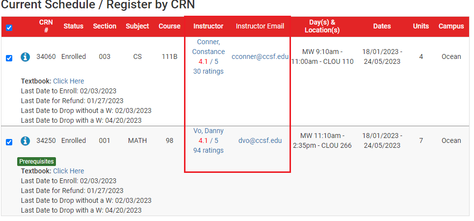
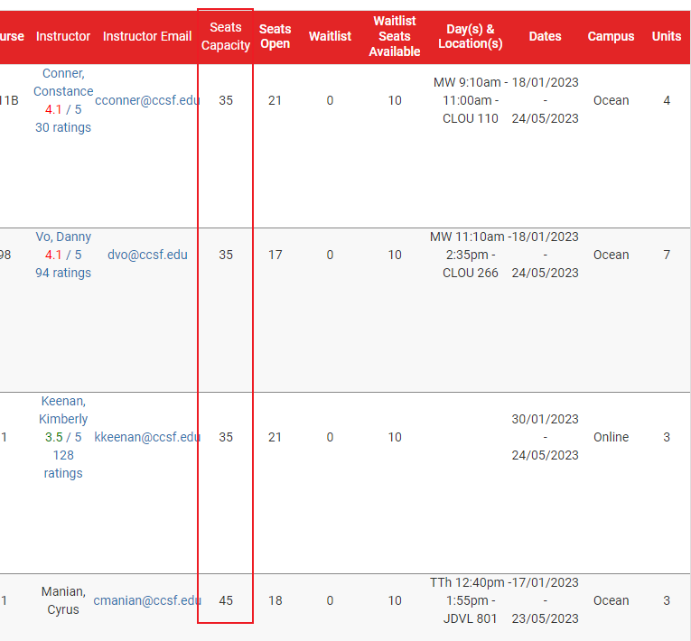

# 如何使用 CCSFSPH

## 1. 登录 Schedule Planner

[https://ccsf.collegescheduler.com/entry](https://ccsf.collegescheduler.com/entry)

选择任意一个学期

可以看到，出现了 Instructor Email 列，还有 Instructor 也出现了评分。

点击 Instructor 的名字，可以跳转到 RateMyProfessor 对应的链接。

点击老师邮箱，可以一键编辑邮件，前提是电脑上要安装了邮件客户端。

选课的时候，可以看到这个课程最多可以多少人报。

