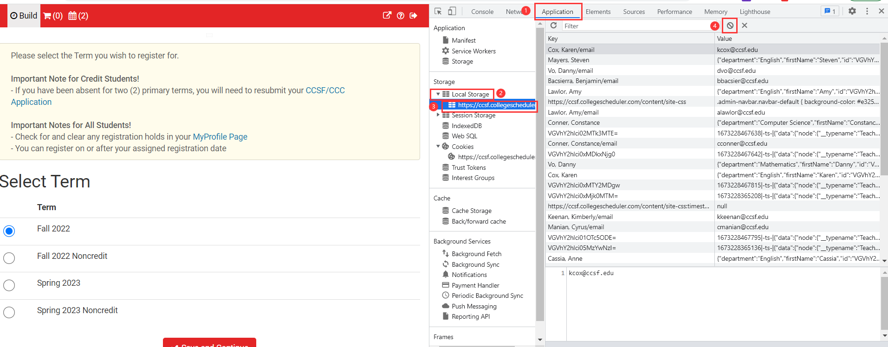
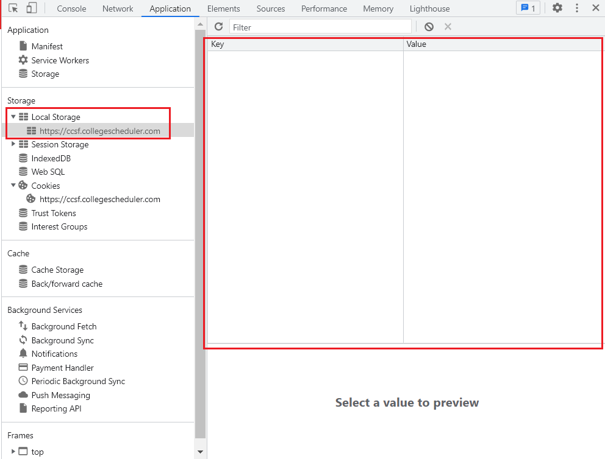

# 如何清理 CCSFSPH 缓存

CCSFSPH 在查询到数据后会在本地生成缓存，以提高下次页面渲染的速度。

如果你发现页面上的数据没有及时更新，或者不正确，可以尝试清理缓存。

访问 Schedule Planner 并登录：[https://ccsf.collegescheduler.com/](https://ccsf.collegescheduler.com/)

登录完成后，按下 <kbd>F12</kbd> 

在出来的页面上方菜单栏中找到【Application】--》点击【Local Stroage】--》选择【https://ccsf.collegescheduler.com】--》【点击 按钮清理所有缓存】

看到以下界面后，说明清理成功了.

然后，按下 <kbd>F5</kbd> 刷新页面。

由于清理了缓存，第一次加载页面时会比较慢。

